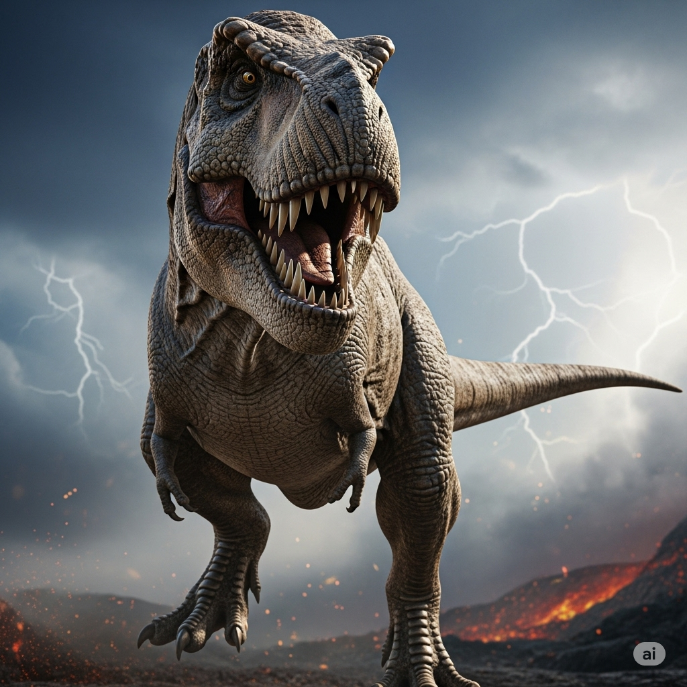

# Tyrannosaurus rex

**Period:** Late Cretaceous  
**Length:** ~12 meters  
**Interesting fact:** T. rex had the strongest bite force of any terrestrial animal.

## Anatomy Highlights

- Massive skull balanced by a long, heavy tail
- Binocular vision
- Two-fingered forelimbs
